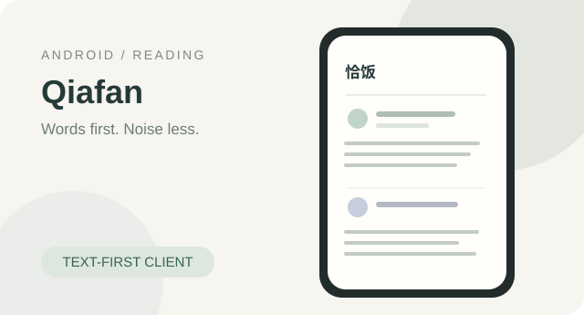
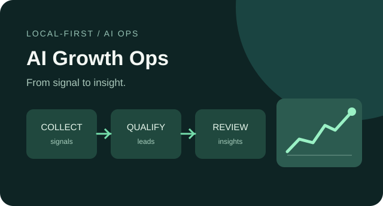

 

**你好，我是 hyperMoss。** 喜欢用代码解决具体问题，也喜欢把零散的想法打磨成可用的产品。

[**精选项目**](#-精选项目) &nbsp;·&nbsp; [**工具与实验**](#-工具与实验) &nbsp;·&nbsp; [**技术栈**](#-技术栈) &nbsp;·&nbsp; [**GitHub 活动**](#-github-活动)

---

## ✨ 精选项目

从 Android 客户端到 AI 工作台，从后端系统到户外小程序。以下项目均可查看源码和各自的使用说明。

<table>
  <tr>
    <td width="50%" valign="top">
      
      <h3><a href="https://github.com/hyperMoss/qiafan">恰饭 · Qiafan ↗</a></h3>
      
为饭否打造的文字优先 Android 客户端。关注、通知、热门、搜索、动态详情与互动，追求安静、专注的阅读体验。

      
<code>Kotlin</code> <code>Android</code> <code>Kuikly</code>

    </td>
    <td width="50%" valign="top">
      
      <h3><a href="https://github.com/hyperMoss/geiwokehu">AI Growth Ops ↗</a></h3>
      
本地优先的获客工作台：关键词素材采集、意向线索筛选、人工客户管理、转化分析，以及按需触发的 AI 辅助判断。

      
<code>Next.js</code> <code>Python</code> <code>SQLite</code>

    </td>
  </tr>
  <tr>
    <td width="50%" valign="top">
      
      <h3><a href="https://github.com/hyperMoss/tech-interview">AI 面试 Agent ↗</a></h3>
      
从题库导入、简历解析到模拟面试、能力评估与专项练习的后端系统，围绕真实训练闭环设计。

      
<code>FastAPI</code> <code>PostgreSQL</code> <code>AI Agent</code>

    </td>
    <td width="50%" valign="top">
      
      <h3><a href="https://github.com/hyperMoss/outdoor-tools">山野光线 ↗</a></h3>
      
服务户外与风光摄影的微信小程序：天气、日出日落、黄金与蓝调时间、朝晚霞预测、拍照地和指北针。

      
<code>WeChat Mini Program</code> <code>JavaScript</code> <code>Open-Meteo</code>

    </td>
  </tr>
</table>

说明：上面的项目封面是为本主页绘制的概念插画，不是应用实机截图。项目功能与完成度以相应仓库 README 为准。

## 🧰 工具与实验

一些为解决具体问题而做的小工具，也包括持续学习过程中的探索。

| 项目 | 简介 | 方向 |
| :--- | :--- | :--- |
| [**dsh-diary**](https://github.com/hyperMoss/dsh-diary) | DeepSeek Harness 的 Markdown 日记、全文搜索与模板管理插件 | AI / Plugin |
| [**FLIGHT-TRACKER**](https://github.com/hyperMoss/FLIGHT-TRACKER) | 监控航线价格、筛选低价航班并推送飞书 | Python / Automation |
| [**life-elephant**](https://github.com/hyperMoss/life-elephant) | 公司人数变化记录与趋势统计小程序 | Taro / Vue 3 |
| [**vitepress-auto-config**](https://github.com/hyperMoss/vitepress-auto-config) | 按文件目录和 Markdown 标题生成 VitePress 导航的思路与示例 | JavaScript / Docs |
| [**Swaggerjson-MockServer**](https://github.com/hyperMoss/Swaggerjson-MockServer) | 基于 Swagger 导出 JSON 的本地 Mock 服务 | Frontend / Tooling |
| [**echarts-demo**](https://github.com/hyperMoss/echarts-demo) | 数据可视化与图表实践 | ECharts |

## 🧑‍💻 技术栈

**日常关注**：Web 应用、跨端开发、AI Agent、自动化、工具链与工程实践。

技术图标代表在项目和学习中涉及的工具，不代表熟练度排名。

## 📈 GitHub 活动

统计与活动图依赖第三方动态图片服务，可能偶尔限流或加载失败；语言占比仅反映仓库代码统计，不代表技术能力。

---

**Keep learning. Keep building. Keep shipping.**

[查看全部仓库](https://github.com/hyperMoss?tab=repositories) · [博客仓库](https://github.com/hyperMoss/hyperMoss.github.io)

